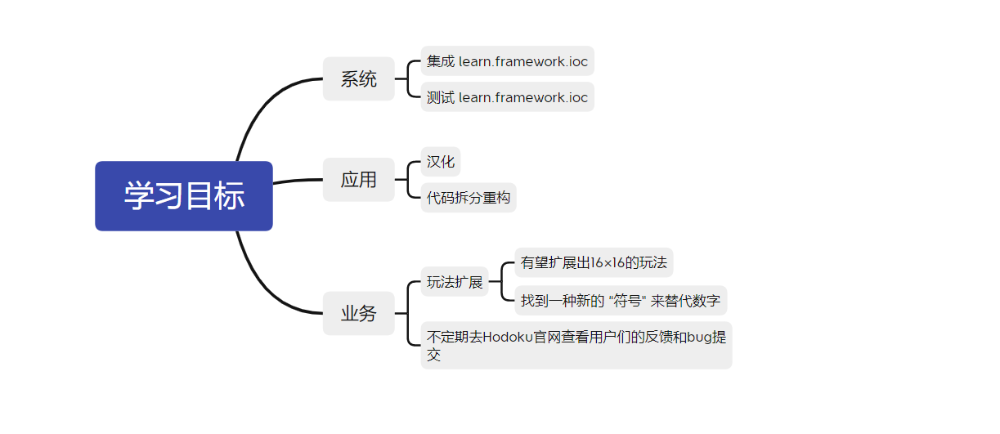
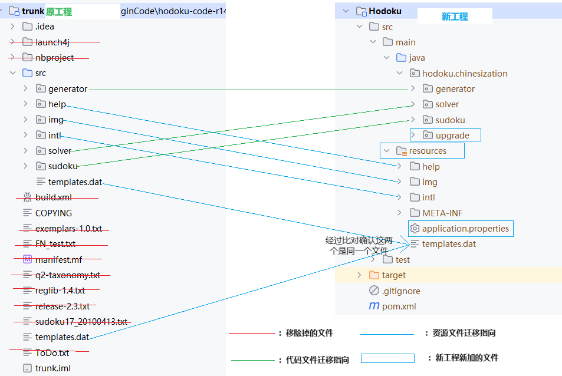

# Hodoku
Hodoku 汉化和结构改造

Hodoku 是一个零几年诞生的数独软件，来自一位德国工程师使用java语言独自开发。上次更新停留在2012年，距今已过去11年了。它非常稳定和强大，只占用不到2M的磁盘空间，但却是我到目前为止见过最强悍的数独工具软件，我非常喜爱这个软件。
我本着学习的想法，下载了它的源码，面对庞大的代码我却无从下手，于是选择汉化的方式渐渐深入了解我爱的这个它。
目前的这个汉化版本有小几百人在使用，在一个sudoku的群里面，是一个数独老师和学员们的群，年龄小到八九岁，大到72岁的奶奶，奶奶是个很厉害的大佬，在数独圈里小有名气。
而我只是在这个群里面提供汉化后的软件支持，回答一些使用疑问，交流一些数独的玩法和技巧。我做着两份我喜爱的事情，这要感谢Java让我有机会学习和试着改变它，感谢数独让我与他们相处在一起，感谢Hodoku作者将两者带给了我。




# 改造范围
- 1.汉化
- 2.资源结构迁移
- 3.代码结构重构
- 4.集成 learn.framework


# 改造日志

## 资源结构迁移



### sudoku包迁移细节
概览
<details>
<summary>
目前 sudoku 包下文件太多，需要设计分包重新组织一下：
</summary>
<p>AboutDialog.java</p>
<p>AboutDialog.form</p>
<p>AllStepsPanel.java</p>
<p>AllStepsPanel.form</p>
<p>AlsInSolutionStep.java</p>
<p>BackdoorSearchDialog.java</p>
<p>BackdoorSearchDialog.form</p>
<p>Candidate.java</p>
<p>CellZoomPanel.java</p>
<p>CellZoomPanel.form</p>
<p>Chain.java</p>
<p>CheckNode.java</p>
<p>CheckRenderer.java</p>
<p>ClipboardMode.java</p>
<p>ColorKuImage.java</p>
<p>ConfigColorkuPanel.java</p>
<p>ConfigColorkuPanel.form</p>
<p>ConfigColorPanel.java</p>
<p>ConfigColorPanel.form</p>
<p>ConfigDialog.java</p>
<p>ConfigDialog.form</p>
<p>ConfigFindAllStepsPanel.java</p>
<p>ConfigFindAllStepsPanel.form</p>
<p>ConfigGeneralPanel.java</p>
<p>ConfigGeneralPanel.form</p>
<p>ConfigGeneratorPanel.java</p>
<p>ConfigGeneratorPanel.form</p>
<p>ConfigLevelFontPanel.java</p>
<p>ConfigLevelFontPanel.form</p>
<p>ConfigProgressPanel.java</p>
<p>ConfigProgressPanel.form</p>
<p>ConfigSolverPanel.java</p>
<p>ConfigSolverPanel.form</p>
<p>ConfigStepPanel.java</p>
<p>ConfigStepPanel.form</p>
<p>ConfigTrainigPanel.java</p>
<p>ConfigTrainigPanel.form</p>
<p>ConfigTrainingDialog.form</p>
<p>DifficultyLevel.java</p>
<p>Entity.java</p>
<p>ExtendedPrintDialog.java</p>
<p>ExtendedPrintDialog.form</p>
<p>ExtendedPrintProgressDialog.java</p>
<p>ExtendedPrintProgressDialog.form</p>
<p>FindAllSteps.java</p>
<p>FindAllStepsProgressDialog.java</p>
<p>FindAllStepsProgressDialog.form</p>
<p>FishChooseCandidatesDialog.java</p>
<p>FishChooseCandidatesDialog.form</p>
<p>GameMode.java</p>
<p>GenerateSudokuProgressDialog.java</p>
<p>GenerateSudokuProgressDialog.form</p>
<p>GeneratorPatternPanel.java</p>
<p>GeneratorPatternPanel.form</p>
<p>GuiState.java</p>
<p>HistoryDialog.java</p>
<p>HistoryDialog.form</p>
<p>KeyboardLayoutFrame.java</p>
<p>KeyboardLayoutFrame.form</p>
<p>ListDragAndDrop.java</p>
<p>ListDragAndDropChange.java</p>
<p>Main.java</p>
<p>MainFrame.java</p>
<p>MainFrame.form</p>
<p>MyBrowserLauncher.java</p>
<p>MyFontChooser.java</p>
<p>MyFontChooser.form</p>
<p>NumbersOnlyDocument.java</p>
<p>Options.java</p>
<p>PrintSolutionDialog.java</p>
<p>PrintSolutionDialog.form</p>
<p>ProgressChecker.java</p>
<p>RegressionTester.java</p>
<p>RestoreSavePointDialog.java</p>
<p>RestoreSavePointDialog.form</p>
<p>SetGivensDialog.java</p>
<p>SetGivensDialog.form</p>
<p>SolutionCategory.java</p>
<p>SolutionPanel.java</p>
<p>SolutionPanel.form</p>
<p>SolutionStep.java</p>
<p>SolutionType.java</p>
<p>SolverProgressDialog.java</p>
<p>SolverProgressDialog.form</p>
<p>SplitPanel.java</p>
<p>SplitPanel.form</p>
<p>StatusColorPanel.java</p>
<p>StatusColorPanel.form</p>
<p>StepConfig.java</p>
<p>Sudoku.java</p>
<p>Sudoku2.java</p>
<p>SudokuCell.java</p>
<p>SudokuConsoleFrame.java</p>
<p>SudokuConsoleFrame.form</p>
<p>SudokuPanel.java</p>
<p>SudokuPanel.form</p>
<p>SudokuSet.java</p>
<p>SudokuSetBase.java</p>
<p>SudokuSetShort.java</p>
<p>SudokuSinglesQueue.java</p>
<p>SudokuStatus.java</p>
<p>SudokuUtil.java</p>
<p>SummaryPanel.java</p>
<p>SummaryPanel.form</p>
<p>WriteAsPNGDialog.java</p>
<p>WriteAsPNGDialog.form</p>
</details>


### 实现计划

根据文件的名称，初步分析可以将这些文件重新组织到不同的包中。以下是一个新的组织方式：

1. 创建一个名为`sudoku`的顶级包。
2. 在`sudoku`包下创建以下子包：
    - `dialog`：用于存放与对话框相关的类文件。
    - `entity`：用于存放与实体相关的类文件。
    - `panel`：用于存放与面板相关的类文件。
    - `util`：用于存放与工具类相关的类文件。
    - `progress`：用于存放与进度相关的类文件。
    - `config`：用于存放与配置相关的类文件。
    - `solver`：用于存放与求解器相关的类文件。
    - `generator`：用于存放与生成器相关的类文件。
    - `step`：用于存放与步骤相关的类文件。
    - `singles`：用于存放与单元格相关的类文件。
    - `status`：用于存放与状态相关的类文件。
    - `test`：用于存放测试相关的类文件。

根据上述组织方式，文件重新分组情况如下：

```text
sudoku
├── dialog
│   ├── AboutDialog.java
│   ├── BackdoorSearchDialog.java
│   ├── ConfigDialog.java
│   ├── ConfigTrainingDialog.java
│   ├── ExtendedPrintDialog.java
│   ├── ExtendedPrintProgressDialog.java
│   ├── FindAllStepsProgressDialog.java
│   ├── FishChooseCandidatesDialog.java
│   ├── HistoryDialog.java
│   ├── KeyboardLayoutFrame.java
│   ├── PrintSolutionDialog.java
│   ├── RestoreSavePointDialog.java
│   └── SetGivensDialog.java
├── entity
│   ├── Candidate.java
│   ├── Chain.java
│   ├── CheckNode.java
│   ├── CheckRenderer.java
│   ├── ColorKuImage.java
│   ├── DifficultyLevel.java
│   ├── DifficultyType.java
│   ├── Entity.java
│   ├── GuiState.java
│   ├── SolutionCategory.java
│   ├── SolutionStep.java
│   └── SolutionType.java
├── panel
│   ├── AllStepsPanel.java
│   ├── CellZoomPanel.java
│   ├── ConfigColorkuPanel.java
│   ├── ConfigColorPanel.java
│   ├── ConfigFindAllStepsPanel.java
│   ├── ConfigGeneralPanel.java
│   ├── ConfigGeneratorPanel.java
│   ├── ConfigLevelFontPanel.java
│   ├── ConfigProgressPanel.java
│   ├── ConfigSolverPanel.java
│   ├── ConfigStepPanel.java
│   ├── ConfigTrainigPanel.java
│   ├── GeneratorPatternPanel.java
│   ├── HistoryDialog.java
│   ├── MainFrame.java
│   ├── SolutionPanel.java
│   ├── SplitPanel.java
│   └── StatusColorPanel.java
├── util
│   ├── ClipboardMode.java
│   ├── MyBrowserLauncher.java
│   ├── MyFontChooser.java
│   ├── NumbersOnlyDocument.java
│   ├── Options.java
│   ├── SudokuUtil.java
│   └── WriteAsPNGDialog.java
├── progress
│   ├── GenerateSudokuProgressDialog.java
│   ├── SolverProgressDialog.java
│   └── SummaryPanel.java
├── config
│   ├── ConfigDialog.java
│   ├── ConfigTrainingDialog.java
│   └── ConfigTrainigPanel.java
├── solver
│   ├── AlsInSolutionStep.java
│   ├── FindAllSteps.java
│   ├── ProgressChecker.java
│   └── RegressionTester.java
├── generator
│   ├── GenerateSudokuProgressDialog.java
│   ├── GeneratorPatternPanel.java
│   └── SudokuGenerator.java
├── step
│   └── StepConfig.java
├── singles
│   ├── SudokuCell.java
│   ├── SudokuSet.java
│   ├── SudokuSetBase.java
│   ├── SudokuSetShort.java
│   └── SudokuSinglesQueue.java
├── status
│   ├── SudokuStatus.java
│   └── SudokuStatusPanel.java
└── test
    └── Main.java
```


##  MainFrame.java 改造计划

MainFrame类是一个主窗口的类，是Hodoku整个应用程序的主要界面和逻辑的交互中心。在类中，有许多成员变量和方法。以下是其中一些比较核心的方法名称功和实际处理的功能：

- initComponents：初始化界面组件的方法。
- savePuzzleAsMenuItemActionPerformed：一个处理"Save Puzzle As"菜单项操作的方法。
- loadPuzzleMenuItemActionPerformed：一个处理"Load Puzzle"菜单项操作的方法。
- configMenuItemActionPerformed：一个处理"Config"菜单项操作的方法。
- statusLabelCellCandidateMouseClicked：一个处理状态标签鼠标点击事件的方法。
- allStepsMenuItemActionPerformed：处理"All Steps"菜单项操作的方法。
- solutionMenuItemActionPerformed：处理"Solution"菜单项操作的方法。
- sudokuOnlyMenuItemActionPerformed：处理"Sudoku Only"菜单项操作的方法。


但这个类存在这四千多行的代码，经过初步了解和分析我计划使用设计模式对这四千多行的类进行拆分重构。以下是结构改造后的结构：
1. 单例模式（Singleton）：对于具有全局唯一实例的属性，可以使用单例模式来确保只有一个实例被创建和使用。
2. 观察者模式（Observer）：对于需要监听属性变化的情况，可以使用观察者模式来实现属性的订阅和通知机制。
3. 建造者模式（Builder）：对于具有复杂初始化过程的属性，可以使用建造者模式来封装对象的创建过程，使其更加灵活和可扩展。
4. 适配器模式（Adapter）：对于需要将属性转换为不同类型或接口的情况，可以使用适配器模式来实现属性的转换和兼容。
5. 策略模式（Strategy）：对于具有不同行为或算法的属性，可以使用策略模式来封装每个属性的具体实现，并在运行时动态选择使用哪个实现。
